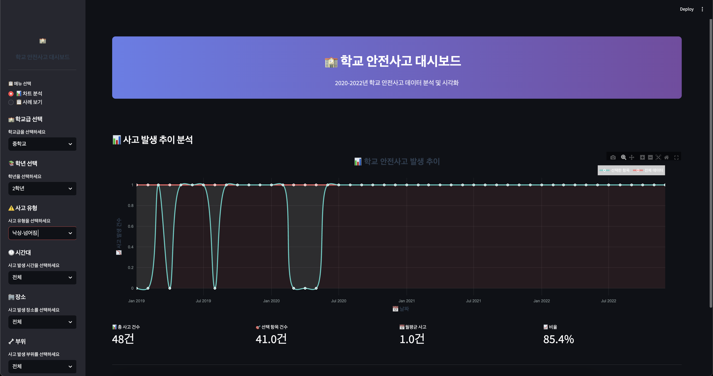

# 학교 안전사고 대시보드 (School Accident Dashboard)

## 프로젝트 개요

이 프로젝트는 2020년부터 2022년까지의 학교 안전사고 데이터를 분석하고 시각화하는 Streamlit 기반의 대시보드입니다. 학교 안전사고의 발생 패턴을 다양한 차원에서 분석하여 안전 관리에 도움이 되는 인사이트를 제공합니다.

## 대시보드 미리보기



## 주요 기능

### 데이터 시각화
- **시계열 차트**: 월별 사고 발생 추이를 시각화
- **필터링 기능**: 다양한 조건으로 데이터 필터링 및 비교 분석
- **인터랙티브 대시보드**: 사용자가 원하는 조건을 선택하여 실시간으로 차트 확인

### 🔍 분석 차원
- **학교급**: 유치원, 초등학교, 중학교, 고등학교, 특수학교, 기타학교
- **학년별**: 각 학교급에 따른 학년별 분석
- **사고 유형**: 다양한 사고 형태별 분석
- **시간대**: 사고 발생 시간대별 분석
- **장소**: 사고 발생 장소별 분석
- **부위**: 사고 발생 부위별 분석
- **활동**: 사고 당시 활동별 분석
- **지역**: 지역별 사고 발생 현황

### 기간 설정
- 연도별 슬라이더를 통한 기간 설정
- 날짜 범위 선택 기능

## 프로젝트 구조

```
school_accident_dashboard/
├── app.py                 # 메인 Streamlit 애플리케이션
├── data_analysis/
│   └── analysis.py        # 데이터 분석 및 처리 로직
├── content/
│   ├── side_bar.py        # 사이드바 UI 컴포넌트
│   └── chart.py           # 차트 생성 및 시각화
├── dashboard_data/
├── Dashboard.png          # 대시보드 스크린샷
└── README.md
```

## 기술 스택

- **Frontend**: Streamlit
- **Data Processing**: Pandas, NumPy
- **Visualization**: Plotly (인터랙티브 차트)
- **Data Source**: Excel 파일 (2020-2022년 학교 안전사고 데이터)

## 설치 및 실행

### 1. 의존성 설치
```bash
pip install streamlit pandas numpy plotly openpyxl
```

### 2. 애플리케이션 실행
```bash
streamlit run app.py
```

## 사용 방법

1. **메뉴 선택**: 사이드바에서 '차트 분석' 메뉴를 선택합니다.
2. **필터 설정**: 
   - 학교급, 학년, 사고 유형 등을 선택하여 분석 범위를 설정
   - 기간 설정을 통해 분석할 연도 범위를 선택
3. **결과 확인**: 선택한 조건에 따른 사고 발생 추이를 차트로 확인
   - 빨간색 선: 전체 데이터
   - 청록색 선: 선택한 조건에 따른 필터링된 데이터
4. **통계 확인**: 하단의 요약 통계 카드에서 주요 지표 확인

## 데이터 소스

- **기간**: 2020년 ~ 2022년
- **내용**: 학교 안전사고 발생 현황
- **포함 정보**: 학교명, 지역, 교육청, 설립유형, 학교급, 사고자 정보, 사고 발생 일시, 사고 유형, 사고 장소, 사고 부위, 사고 당시 활동 등

## 개발 목적

이 대시보드는 학교 안전사고 데이터를 체계적으로 분석하여 다음과 같은 목적을 달성합니다:

- 학교 안전사고의 발생 패턴 파악
- 시기별, 지역별, 유형별 사고 발생 추이 분석
- 학교 안전 정책 수립을 위한 데이터 기반 인사이트 제공
- 예방적 안전 관리 방안 도출